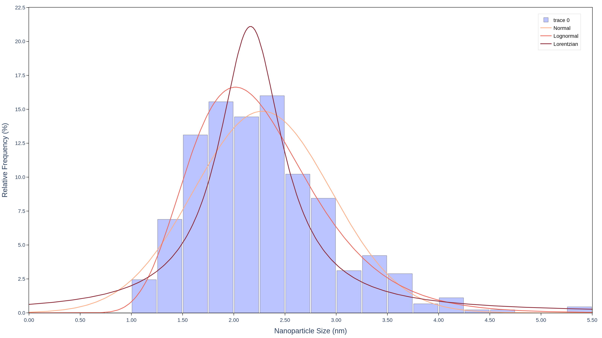

# Statistics Behind This Tool

This document explains the statistics this program runs on your
nanoparticle measurements — what each calculation is actually asking,
why these particular methods make sense for particle sizes, and the
precise formulas used. It's written so that no math or statistics
background is assumed; every formula is followed by a plain-language
explanation of what it means.

See also: **[README.md](../README.md)** · **[USER DOCUMENTATION](USER_DOC.md)** · **[DEVELOPER DOCUMENTATION](DEV_DOC.md)** · **[CHEATSHEET](CHEATSHEET.md)**

---

## 1. What problem is this solving?

Imagine you've measured 500 nanoparticles from a microscopy image and
you have a plain list of 500 numbers (their diameters in nanometers).
That list, on its own, is hard to reason about — you can't easily answer
questions like "is this batch consistent?" or "how does this batch
compare to a different one?"

Statistics turns that raw list into a small set of meaningful numbers and
a mathematical shape (a "distribution") that describes the batch as a
whole. This program does that in three steps:

1. **Describe the data** — compute simple summary numbers (a typical
   size, how spread out the sizes are, etc.) directly from your
   measurements, no assumptions required.
2. **Fit a theoretical shape to it** — try to find a well-known
   mathematical curve that matches the shape of your data, and work out
   exactly which version of that curve fits best.
3. **Check whether that fitted shape is actually believable** — a
   computer will always hand you *some* fitted curve, even for data it
   doesn't really describe well. Step 3 is a formal check on whether the
   fit from step 2 should be trusted or rejected.

The rest of this document walks through each of those three steps.

---

## 2. Step 1: describing the data (the "moments")

These numbers are computed straight from your measurements — they don't
assume the data follows any particular shape at all.

| Statistic | In plain words | Formula |
|---|---|---|
| **Mean** | The average size — add up every measurement and divide by how many there are. | $\bar{x} = \dfrac{1}{n}\sum x_i$ |
| **Median** | The middle value if you lined up every particle from smallest to largest. Unlike the mean, a few unusually huge particles can't drag it around. | middle value of sorted data |
| **Variance / Standard deviation** | How spread out the sizes are around the mean. *Variance* is the average squared distance from the mean; *standard deviation* is its square root, which puts it back in nanometers so it's directly comparable to the sizes themselves. | $\dfrac{1}{n-1}\sum(x_i-\bar{x})^2$ (variance) |
| **Skewness** | Whether the batch has a "long tail" on one side. A skewness of 0 means the sizes are evenly balanced around the mean; a positive number means there's a tail of larger-than-typical particles stretching out to the right — which is exactly what's expected for nanoparticles (see §3). | 3rd standardized moment of the data |
| **Coefficient of variation (CV)** | The standard deviation expressed as a fraction of the mean, instead of in nanometers. This makes "how spread out" comparable between two batches even if one batch has much bigger particles overall. | $\text{CV} = \sigma / \mu$ |
| **Polydispersity Index (PDI)** | A standard term in particle science for the same idea as CV, just squared. Values close to 0 mean the particles are very uniform in size ("*monodisperse*"); larger values mean a wide mix of sizes ("*polydisperse*"). | $\text{PDI} = \text{CV}^2$ |
| **Sauter mean diameter (D32)** | A different kind of "average size" that leans toward the bigger particles rather than treating every particle equally. This matters because a particle's *surface area relative to its volume* — important in chemistry and drug delivery — is dominated by the larger particles in a batch, not the small ones. | $\dfrac{\sum x_i^3}{\sum x_i^2}$ |

---

## 3. Step 2: fitting a theoretical shape

### Why fit a shape at all?

Once you have hundreds of measurements, it's useful to describe the
*whole batch* with a smooth mathematical curve instead of a raw list of
numbers — a curve makes it possible to say things like "95% of particles
should fall between X and Y nm," compare batches quantitatively, and
communicate the result compactly. This program tries **three** different
candidate curves and fits each one to your data:

| Shape | What it looks like | Why it's a reasonable candidate here |
|---|---|---|
| **Lognormal** | Skewed to the right — a peak with a longer tail toward larger sizes, and it never goes below zero. | Nanoparticles typically grow through processes where each particle's growth is roughly *proportional to its current size* (a multiplicative, not additive, process). That kind of growth naturally produces exactly this right-skewed, always-positive shape — it's usually the best-fitting model for real particle data. |
| **Normal ("bell curve")** | Symmetric, same shape on both sides of the peak. | Included as a familiar reference point — fitting it alongside the lognormal makes any skew in your data visible by contrast, since a symmetric curve simply can't bend to match a skewed batch. |
| **Lorentzian (Cauchy)** | Symmetric like the Normal curve, but with a sharper peak and noticeably "heavier tails" — more extreme values than a Normal curve would predict. | Useful as a check for batches with more outlier-like large or small particles than a Normal curve allows for, without assuming the data leans to one side the way a Lognormal model does. |

### How the fitting actually works

Fitting means finding the specific version of a curve (i.e. the exact
numbers that define its position and width) that best matches your data.
This program uses a method called **Maximum Likelihood Estimation
(MLE)**: in plain terms, it searches for the curve that makes your
*actual observed measurements* as probable as possible, out of every
possible version of that curve shape. For the Normal and Lognormal
curves this search has an exact, direct mathematical solution; for the
Lorentzian, the computer searches numerically until it converges on the
best answer.

Each curve is controlled by two numbers ("parameters"):

- **Normal:** its center ($\mu$) and its width ($\sigma$) — for a Normal
  curve, the mean, median, and peak all sit at exactly the same spot.
- **Lognormal:** also has a $\mu$ and $\sigma$, but here they describe
  the *logarithm* of your data, not your data directly. Practically,
  this is why a lognormal curve's mean, median, and peak all land at
  three *different* sizes, unlike the Normal curve.
- **Lorentzian:** its peak position ($x_0$) and how wide the peak is
  ($\gamma$).

**One important quirk:** the Lorentzian/Cauchy curve mathematically has
no defined average size and no defined spread at all — its tails are so
heavy that those calculations never settle on a finite answer. This
isn't a limitation of this program; it's a genuine mathematical property
of that curve. So when you see the mean/standard-deviation/CV/PDI fields
blank for the Lorentzian fit, that's the expected, correct result — not
a missing calculation.

The chart below shows one dataset with all three curve shapes fitted to
it, so you can see how differently they respond to the same data:

*Illustrative example using the synthetic sample dataset
(`nanoparticle_sample_data.csv`), generated from a Lognormal distribution
to demonstrate how differently each fitted curve responds to the same
data — not real experimental measurements.*

Notice how the Lognormal curve (the shape that actually generated this
particular example data) tracks the right-leaning shape closely, the
Normal curve is forced into a symmetric shape that misses the peak and
overshoots the left side, and the Lorentzian's sharper peak and heavier
tails clearly diverge from the data in both directions.

### How "wide" is the peak? (FWHM)

Alongside center and width parameters, the program reports each fitted
curve's **Full Width at Half Maximum (FWHM)** — literally, how wide the
curve is at exactly half its peak height. It's a simple, visual way to
describe "how spread out" a batch is, in nanometers, without needing to
understand variance or the curve's own internal parameters.

- **Normal:** $\text{FWHM} = 2\sqrt{2\ln 2}\,\sigma \approx 2.35\,\sigma$
  — a fixed multiple of its width parameter.
- **Lognormal:** has no simple formula for this (its two sides aren't
  mirror images), so the program finds it directly: it looks at the
  curve's peak height, then numerically searches left and right for the
  two points where the curve has dropped to exactly half that height.
- **Lorentzian:** $\text{FWHM} = 2\gamma$ — in fact, this *is* how the
  Lorentzian's own width parameter is defined in the first place.

The report also includes a *relative* version of this (FWHM divided by
the peak position), which makes the "how spread out" comparison fair
between batches of very different particle sizes.

### What "maximum likelihood" is actually maximizing: log-likelihood
 
MLE picks the curve that makes your data most probable — but "how
probable" needs a single number to compare candidate curves against each
other, and that number is the **log-likelihood**. For each fitted curve,
the program plugs every one of your measurements into that curve's
formula, multiplies together how likely each individual measurement was
under that curve, and reports the logarithm of the result (logarithms
are used purely so the numbers stay manageable — multiplying hundreds of
small probabilities together would otherwise produce an extremely tiny
number).
 
The practical reading: **a higher (less negative) log-likelihood means
that curve, as fitted, considers your actual measurements more
plausible.** It's what MLE searches to maximize in the first place, and
reporting it alongside each fit lets you see, at a glance, which of the
three shapes the fitting process itself considered the best explanation
for your data — before even running the formal KS test in step 3. It's
a useful first signal, but not a substitute for that test: log-likelihood
alone doesn't tell you whether a fit is *good enough* to trust, only
which of the three candidates was relatively better or worse.

---

## 4. Step 3: is the fitted curve actually believable?

Here's the catch with step 2: the fitting process will *always* return
some curve, even for data that curve doesn't actually describe well.
Fitting a Normal curve to data that's obviously lopsided will still
produce *a* mean and *a* width — the math doesn't know to refuse. So a
separate, independent check is needed: **does this fitted curve actually
hold up against the data, or should we reject it?**

This program answers that with the **Kolmogorov–Smirnov (KS) test**,
one of the standard statistical tools for exactly this question.

**How to think about it:** take your real measurements and build a
staircase-shaped curve out of them — at any given size, what fraction of
your particles are that size or smaller? Now compare that staircase to
the *smooth* curve the fitted distribution predicts for the same
question. If the fit is good, the staircase should hug the smooth curve
closely everywhere. The KS test measures the single largest gap between
the two, anywhere along the chart, and turns that gap into a formal
verdict.

**Turning that gap into a yes/no answer:**

- The test starts by assuming the fit *is* correct (this assumption is
  called the **null hypothesis**).
- It then asks: *if the fit really were correct, how likely would it be
  to see a gap this large just from ordinary sampling randomness?* That
  likelihood is the **p-value**.
- A small p-value means "this large a gap would be a rare coincidence if
  the fit were actually correct" — so the fit is rejected. A p-value
  that isn't small means the gap is unremarkable, and there's no
  statistical reason to doubt the fit.
- The cutoff for "small" is the significance level, configured as
  `ALPHA` (default `0.05`, i.e. 5%) — a standard, conventional threshold
  in statistics. A p-value below `ALPHA` rejects the fit; a p-value at
  or above it does not.

This is what turns "the curve looks about right" into a specific,
repeatable conclusion — the same test applied the same way every time,
rather than a judgment call made by eye.

---

## 5. Putting it all together

| What you get | Answers |
|---|---|
| Moments (mean, median, spread, skewness, CV, PDI, D32) | "What does this batch of particles look like, without assuming any particular shape?" |
| Fitted parameters ($\mu$/$\sigma$ or $x_0$/$\gamma$) and FWHM per curve | "What theoretical curve best matches this data, and how wide/positioned is it?" |
| KS test statistic and p-value per curve | "Is that fitted curve actually a statistically defensible description of the data, or should it be rejected?" |

Every one of these values is computed once by the program and reused
everywhere it's displayed (in the printed report and in the interactive
chart) — see
[§4.1 of the Developer Guide](DEVELOPER_GUIDE.md#41-computation-returns-dataclasses-not-tuples-or-dicts)
for how that's structured in code.